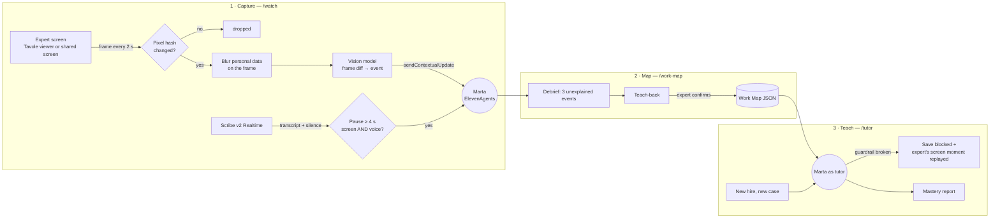

# The AI Apprentice — Marta

**Hack-Nation × ElevenLabs · 7th Global AI Hackathon · Challenge 01**

**Live demo:** https://ai-apprentice-marta.lovable.app

> A senior architect retires and takes thirty years of judgment with her. **Marta** — a voice apprentice built on ElevenLabs — watches the architect review drawings, asks *why* at the right pause, confirms she understood, then teaches the next junior architect on a case the expert never showed.

Use case: **architectural drawing review** (revisions, approvals, issuing sheets to site). It is real knowledge-driven desk work: a wrong revision sent to site costs money, and the rules for when to stop live only in senior architects' heads.

---

## How it works



### Module 1 — Capture (`/watch`)
- The expert works in the built-in drawing viewer (**Tavole**) or clicks **Share screen** to work in any app.
- Every 2 s a frame is hashed in the browser. Unchanged frames are dropped; when the screen settles after a change, the pair of frames goes to a vision model that returns one event (`"South elevation moved to rev B"`).
- The expert can **sketch on the drawing**: sketches become events too, and Marta asks about them first.
- Marta stays silent while the expert works. She speaks only when **both** the screen and the voice have been quiet for ≥ 4 s, with at least 12 s between questions. At least one question is always about a guardrail: *"When would you never do this?"*
- **Off the record** button: frame capture and transcription stop, and nothing from that period is saved.

### Module 2 — Map (`/work-map`)
- After the task, Marta picks **3 events that were never explained live** and asks about them.
- **Teach-back:** she explains the whole process back in her own words. The session counts as "understood" only after the expert confirms it.
- The result is a **clickable Work Map**: each step shows the screen moment (thumbnail + timestamp), the decision, the reason in the expert's own words, and its guardrails. **Each guardrail links to its own screen moment and quote.**
- Saved in **Italian and English**. **Export for agents** downloads steps and guardrails as instructions another agent can load.

### Module 3 — Teach (`/tutor`)
- The new hire gets a **different building** (sheets 11–15), never shown by the expert.
- Before each key step Marta asks: *"What would you do next, and why?"* and compares the answer with the Work Map.
- Guardrails are checked locally before **Issue**. If one is broken, saving is blocked, and Marta replays the expert's screen moment and explains using the expert's own reasoning.
- At the end: a **Mastered / To practise** report for each step and guardrail, plus the next exercise.
- The expert can explain in Italian while the tutor teaches in English (IT/EN selector).

---

## The Apprentice Test — how the demo answers it

A live checklist (`TestsChecklist`) is computed from real session data, not hard-coded.

| # | Question | Our answer | Measured as |
|---|---|---|---|
| 1 | **When to ask** | Pause detector: ≥ 4 s with no screen change **and** no speech (Scribe v2), plus a 12 s minimum gap between questions | every question is logged with `pauseMs` and `silenceMs` |
| 2 | **What to ask** | Only about high-significance events that were not explained; at least one guardrail question | ≥ 3 questions, ≥ 2 *why* + ≥ 1 *guardrail* |
| 3 | **When it has understood** | Debrief on unexplained events, then a teach-back the expert must confirm | `teachbackConfirmed` |
| 4 | **Whether the new hire learned** | New case + predictions + blocked mistakes + final check, scored against the Work Map | score ≥ 60/100, blocks counted |
| 5 | **Trust** | Off-the-record mode; personal data (names, emails, phones, IBAN, tax codes, addresses) redacted from text and **blurred in frames** before anything is saved | dropped frames, blurred regions, redactions counted |

---

## Stack

| Layer | Tech |
|---|---|
| App | TanStack Start (React 19, TypeScript), Tailwind CSS, shadcn/ui |
| Voice agent | **ElevenAgents** (Expressive) via `@elevenlabs/react`, WebRTC; one agent plays both interviewer and tutor through per-session prompt overrides |
| Listening | **Scribe v2 Realtime** (single-use token from a server function) |
| Vision + reasoning | Vision model through the Lovable AI gateway (`src/lib/ai.server.ts`) |
| Privacy | Presidio-compatible redaction (same entity types and `<ENTITY>` replacement format) in `src/lib/redact.server.ts`; uses a real Presidio Analyzer if `PRESIDIO_ANALYZER_URL` is set |
| Data | Supabase (Postgres, table `apprentice_sessions`, migration in `drizzle/migrations`) |

### Key files
```
src/routes/            watch · work-map · knowledge · tutor · history · index
src/components/watch/WatchSession.tsx   capture, pause detector, debrief, teach-back
src/components/tutor/TutorSession.tsx   tutor, predictions, block + replay, mastery
src/hooks/useCaptureEngine.ts           frame hashing → blur → vision diff
src/hooks/useMarta.ts                   ElevenAgents session, contextual updates
src/lib/guardrails.ts                   local guardrail checks before saving
src/lib/tests.ts                        the 5 Apprentice Tests
src/lib/redact.server.ts                personal-data redaction
src/lib/apprentice.functions.ts         server functions (diff, debrief, Work Map, tutor)
```

---

## Run locally

```sh
bun install
cp .env.example .env   # fill in the keys
bun run dev
```

Required:
- `ELEVENLABS_API_KEY` and an ElevenAgents agent. Set its ID in `src/lib/elevenlabs.functions.ts` (`AGENT_ID`). In the agent's **Security** settings, enable overrides for **system prompt, first message and language**: Marta's prompts are sent per session.
- `LOVABLE_API_KEY` for the AI gateway, or replace `callAI` in `src/lib/ai.server.ts` with any vision-capable model.
- Supabase URL and keys; run the migration in `drizzle/migrations`.

Optional: `PRESIDIO_ANALYZER_URL`.

---

## Moonshot

**A living studio memory.** Every senior architect's Work Maps merge into one map that stays current. When a regulation or a client changes the work, Marta asks only about what is new, and the same guardrails let agents take routine steps (revision checks, issue lists) while people keep the judgment calls.

---

Built by **Raffaella Ciani — RC XRArch** (architect, XR developer, teacher) · Puglia, Italy
